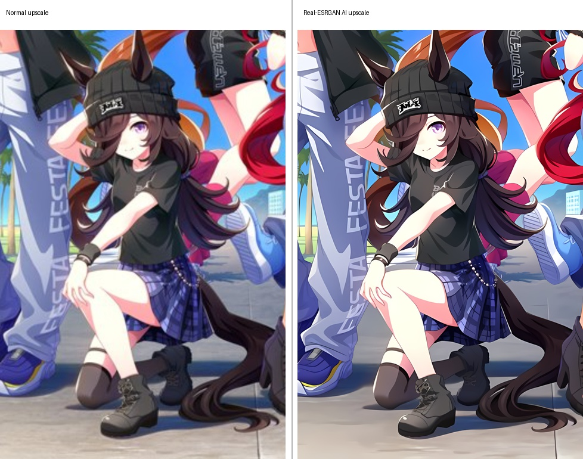

# Anime Wallpaper Upscaler

Local Real-ESRGAN upscaling for anime, illustration, game, and wallpaper images.
The default wallpaper mode preserves the complete original composition and uses a
soft background to fill the target screen ratio.

## What It Does

- Runs Real-ESRGAN locally through `realesrgan-ncnn-vulkan`.
- Produces a 4x PNG upscale, a desktop-ready wallpaper, and a comparison image.
- Supports composition-preserving output and optional crop-to-fill output.
- Does not upload images to an API and does not redraw the artwork by default.

## Requirements

- Windows 10/11 with a Vulkan-capable GPU.
- Python 3.10 or newer.
- Real-ESRGAN NCNN/Vulkan executable and model files.

The executable and model files are external dependencies. Download them from the
[Real-ESRGAN NCNN Vulkan project](https://github.com/xinntao/Real-ESRGAN-ncnn-vulkan)
and follow its license terms. Do not commit the binary or model files to this repository.

## Install

```powershell
git clone https://github.com/zc4578980-tech/anime-wallpaper-upscaler.git
cd anime-wallpaper-upscaler
.\install.ps1
```

Or install the Python dependency manually:

```powershell
python -m pip install -r requirements.txt
```

## Quick Start

```powershell
python .\scripts\upscale_wallpaper.py `
  --input "C:\path\to\image.jpg" `
  --tool-dir "C:\path\to\realesrgan-ncnn-vulkan-v0.2.0-windows" `
  --target 2560x1600 `
  --copy-desktop
```

The tool directory may also be configured for the current PowerShell session:

```powershell
$env:REALESRGAN_TOOL_DIR = "C:\path\to\realesrgan-ncnn-vulkan-v0.2.0-windows"
python .\scripts\upscale_wallpaper.py --input "C:\path\to\image.jpg"
```

Outputs are written to `outputs/wallpapers` by default. Use `--mode cover` only when
cropping is acceptable; the default `--mode preserve` keeps the full composition.

## Example



The demo uses a portrait crop selected from the source image. Both panels keep the crop's
original aspect ratio; use `--compare-full-input` when the input file is already the desired
selection.

This comparison image is included for technical demonstration only. The artwork is user-provided
and carries third-party copyright markings; replace it with an image you have permission to
redistribute before using this repository in a public project or commercial context.

## License

The skill instructions and wrapper script are released under the MIT License. Real-ESRGAN,
NCNN, Vulkan runtimes, and model files remain subject to their respective licenses.
