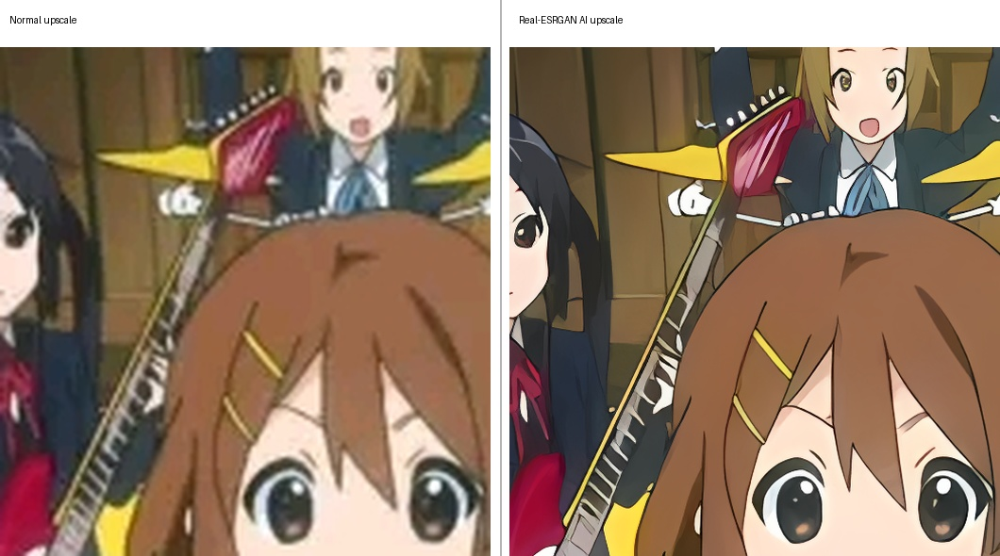
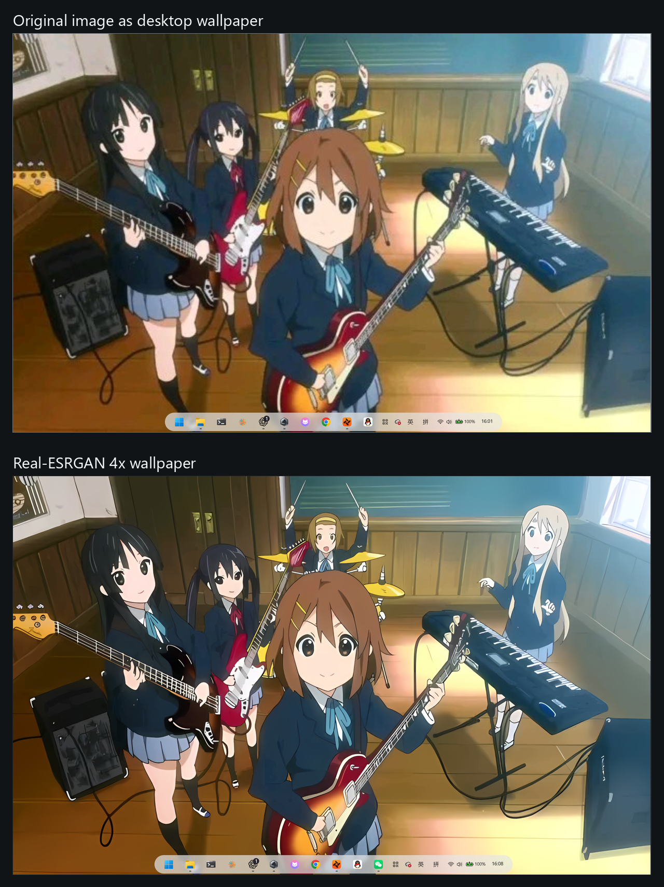

# Anime Wallpaper Upscaler

## Pause a frame. Keep it on your desktop.

**Turn anime screenshots into screen-ready Windows wallpapers while preserving the complete
composition.** After setup, drag a screenshot onto the desktop shortcut, choose 2x/3x/4x, and the
local workflow detects your physical screen and Vulkan GPU automatically.

- Windows 10/11
- Local processing; screenshots are not uploaded
- Official Real-ESRGAN NCNN/Vulkan inference
- Full-composition wallpaper output by default

[简体中文](README.zh-CN.md)

## From Screenshot to Wallpaper

### See the 4x detail difference



### See the result on a real 2560x1600 Windows desktop



The example uses one recorded local run: a 721x406 screenshot, official
`realesrgan-x4plus-anime` at 4x, `preserve` mode, and a 2560x1600 target on an NVIDIA GeForce RTX
5070 Ti Laptop GPU. [Run evidence](docs/release/evidence/k-on-promotion-run.json) ·
[Promotion asset notice](docs/assets/promotion/NOTICE.md)

## Three Steps

1. Download and extract the latest Windows ZIP from [Releases](https://github.com/zc4578980-tech/anime-wallpaper-upscaler/releases/latest).
2. Double-click `install.cmd`, review the upstream terms, and approve the verified runtime download.
3. Drag a screenshot or folder onto the desktop shortcut and choose 2x, 3x, or 4x.

No manual model installation is required. Real-ESRGAN and ncnn perform inference; this repository
provides the Windows wallpaper workflow, not an original model. Upscaling cannot guarantee recovery
of every detail absent from the source.

## How This Differs from Official Real-ESRGAN

| Capability | Official Real-ESRGAN / NCNN-Vulkan | This project |
| --- | --- | --- |
| Super-resolution inference and models | Provides the algorithm, models, and Vulkan executable | Downloads and invokes the official release; claims no original algorithm or model |
| Full-composition wallpaper output | Raw upscale output | `preserve` mode keeps the entire composition |
| Physical-screen adaptation | Manual dimensions passed to the executable or later tools | Detects the physical primary-display resolution, with a manual override |
| Mismatched aspect ratios | Not a wallpaper-composition workflow | Uses a softened, blurred copy as fill behind the uncropped image |
| Wallpaper batches | Upstream executable accepts its own file/folder inputs | Adds repeated inputs, folder recursion, per-item isolation, and summary logs |
| Comparison images | Not generated by the official executable | Generates a repeatable before/after detail comparison by default |
| Windows onboarding | Upstream executable and documentation | Adds verified setup, a local Python environment, drag/drop, shortcut, and repair guidance |
| Agent / natural-language invocation | Command-line arguments are supplied directly | Maps plain-language wallpaper requests to documented wrapper options |

The upstream projects do the super-resolution work. This repository's independent value is
the Windows wallpaper workflow around that inference.

## Agent Skill (Advanced)

After setup, an Agent can turn a natural-language request into the same deterministic local
wrapper command used by the CLI. For example:

- "Upscale `C:\Pictures\wallpaper.png` 3x, fit my current screen, and keep the full image."
- "Process every wallpaper under `C:\Pictures\Anime`, including subfolders, at 2x."
- "Use Vulkan GPU 0 and put all 4x results in `D:\Wallpaper Output`."
- "Crop to cover the screen" only when losing edge content is acceptable.

Setup registers this repository as:

```text
%USERPROFILE%\.codex\skills\anime-wallpaper-upscale -> repository root
```

The Agent resolves the request to explicit options and runs the wrapper, for example:

```powershell
.\.venv\Scripts\python.exe .\scripts\upscale_wallpaper.py `
  --input "C:\Pictures\wallpaper.png" `
  --scale 3 `
  --target auto `
  --gpu auto `
  --mode preserve
```

The Agent does not replace or reimplement inference:

```text
User intent -> Agent Skill -> wallpaper wrapper
            -> official realesrgan-ncnn-vulkan.exe
            -> official models / ncnn / Vulkan
```

## Requirements

- 64-bit Windows 10 or 11 and PowerShell 5.1 or newer.
- Windows Package Manager (`winget`) for the easiest first run. If Python is missing, the
  installer offers to install official Python 3.12 for the current user after confirmation.
- Alternatively, an existing 64-bit Python 3.10 or newer.
- A Vulkan-capable GPU with a current NVIDIA, AMD, or Intel driver.
- Enough free disk space for the official runtime, models, and generated images.

Processing stays on the PC. The wrapper does not upload input images or perform generative
redrawing.

## Setup

Double-click `install.cmd`, or run the equivalent PowerShell command shown above. The installer:

1. shows the upstream source and license notice before downloading it;
2. finds Python or, with confirmation, installs official Python 3.12 per-user through `winget`;
3. creates a project-local `.venv` and installs `requirements.txt`;
4. downloads the pinned official Real-ESRGAN Windows release into ignored `tools/`;
5. verifies the archive size and SHA-256, then checks the executable and every pinned 2x/3x/4x
   model file before atomically installing them;
6. installs a Codex skill junction and creates a drag/drop desktop shortcut; and
7. runs the command-line help smoke test.

The executable and all required model files are downloaded automatically from the official
upstream release and are never committed to this repository. Ordinary users should not download
or move model files themselves. For unattended setup, read
[Third-Party Notices](THIRD_PARTY_NOTICES.md) first, then pass `-AcceptUpstreamLicense`; add
`-InstallPython` only when per-user Python installation is also authorized.
Interrupted downloads remain bounded under `tools\.downloads` and can resume when setup is
run again.

### Advanced recovery: use an existing official runtime

This is not part of normal installation. Advanced users who already maintain an official
runtime may point the wrapper at its extracted directory:

```powershell
.\.venv\Scripts\python.exe .\scripts\upscale_wallpaper.py `
  --input "C:\Pictures\wallpaper.png" `
  --tool-dir "C:\Tools\realesrgan-ncnn-vulkan-20220424-windows"
```

That directory must contain `realesrgan-ncnn-vulkan.exe` and the compatible `.param`/`.bin`
files under `models\`. `REALESRGAN_TOOL_DIR` can provide the same directory for the current
environment.

## Command Line

Process several files and a folder in one batch:

```powershell
.\.venv\Scripts\python.exe .\scripts\upscale_wallpaper.py `
  --input "C:\Pictures\one.png" `
  --input "C:\Pictures\two.jpg" `
  --input "C:\Pictures\Wallpaper Folder" `
  --recursive `
  --scale 3 `
  --target auto `
  --gpu auto `
  --mode preserve
```

`--input` accepts a JPG, JPEG, PNG, WebP, or folder and can be repeated. A folder is scanned
at its top level unless `--recursive` is present. Duplicate paths are processed once.

| Option | Meaning and default |
| --- | --- |
| `--input PATH` | Required image or folder; repeat for multiple inputs |
| `--recursive` | Include supported images in folder subdirectories |
| `--scale {2,3,4}` | Upstream upscale factor; default `4` |
| `--target auto\|WIDTHxHEIGHT` | Physical primary display by default; for example `2560x1600` |
| `--gpu auto\|ID` | Probe Vulkan devices and let ncnn choose by default; use a listed numeric ID to override |
| `--model MODEL` | Override the scale-aware upstream model selection |
| `--mode {preserve,cover}` | `preserve` by default; `cover` crops to fill the target |
| `--out-dir PATH` | Put all batch results under one chosen directory |
| `--tool-dir PATH` | Advanced override: use an existing official runtime directory |
| `--copy-desktop` | Also copy each finished wallpaper to the current user's Desktop |
| `--compare-full-input` | Compare the complete input instead of the default detail crop |
| `--x-bias 0..1` / `--y-bias 0..1` | Position the optional `cover` crop; default `0.5` |
| `--no-compare` | Skip the before/after comparison |
| `--no-upscaled-source` | Remove the raw upscaled PNG after composing the wallpaper |
| `--no-open-output` | Do not open successful output folders at the end |

`--target auto` uses DPI-aware Windows APIs. If detection fails, the wrapper reports a
warning, uses `2560x1600`, and explains how to override it. GPU probing lists the Vulkan
devices reported by the official executable; `--gpu auto` leaves final device selection to
ncnn.

## Modes and Outputs

- `preserve` keeps the complete image centered and fills unused screen area with a dimmed,
  blurred version of the same image. This is the default.
- `cover` fills the screen by cropping. Use it only when losing edge content is acceptable.

Without `--out-dir`, results go to `Wallpaper Upscaler Output` beside an input file or inside
an input folder. Recursive folder jobs mirror their relative subfolder layout. Each successful
item normally produces:

- `<name>_realesrgan_<scale>x.png`: raw output from the official runtime;
- `<name>_wallpaper_AI_<width>x<height>_<mode>_<scale>x.jpg`: finished wallpaper; and
- `<name>_AI_compare_<scale>x.jpg`: detail comparison.

Every output root receives `anime-wallpaper-upscaler.log` with success/failure counts and one
line per item. A bad image does not stop the remaining batch; partial failure returns exit code
`1`, while setup or input errors return `2`.

## Repair Guide

| Symptom | Repair |
| --- | --- |
| Python is not found or is older than 3.10 | Double-click `install.cmd` and approve the offered per-user Python installation. If `winget` is unavailable, install 64-bit Python from [python.org](https://www.python.org/downloads/windows/), enable **Add python.exe to PATH**, then rerun `install.cmd` |
| Download stops or the network fails | Check access to GitHub Releases and rerun `install.cmd`; the verified partial download is retained for a bounded resume attempt |
| Executable or model files are missing | Launch the shortcut or rerun `install.cmd`; setup automatically restores the pinned official executable and models |
| No Vulkan GPU is reported / Vulkan initialization fails | Install the latest driver from [NVIDIA](https://www.nvidia.com/Download/index.aspx), [AMD](https://www.amd.com/en/support/download/drivers.html), or [Intel](https://www.intel.com/content/www/us/en/download-center/home.html), then retry |
| A selected GPU ID is rejected | Read the detected GPU list printed by the command and pass one of those numeric IDs, or use `--gpu auto` |
| An image is damaged or unsupported | Re-export it as a valid JPG, JPEG, PNG, or WebP and rerun the batch |

## Rebuild Visual Assets

The repository keeps generation reproducible instead of editing overview graphics by hand. Build
the project-owned demo layouts with:

```powershell
python .\scripts\build_original_demo.py `
  --output ".\docs\assets\demo-source-original.png"

python .\scripts\build_demo_assets.py `
  --source ".\docs\assets\demo-source-original.png" `
  --upscaled "C:\Demo\original_realesrgan_4x.png" `
  --wallpaper "C:\Demo\original_wallpaper.jpg" `
  --overview ".\docs\assets\workflow-overview.jpg" `
  --social-preview ".\Wallpaper Upscaler Output\demo-social-preview.jpg"
```

The included fixture is a project-authored technical scene with four colored edge markers. The
triptych contains each panel without cropping.

Rebuild the current campaign preview from the two selected comparison assets with:

```powershell
python .\scripts\build_promotion_assets.py `
  --detail ".\docs\assets\promotion\k-on-detail-comparison-4x.png" `
  --desktop-comparison ".\docs\assets\promotion\k-on-desktop-comparison.png" `
  --output ".\docs\assets\social-preview.jpg"
```

The K-ON! example is not a project-owned MIT asset. See the
[Promotion asset notice](docs/assets/promotion/NOTICE.md) before reusing or publishing it. For a
replacement, use only artwork you created or have clear permission to redistribute.

## Attribution and License

This project is an integration wrapper built on
[Real-ESRGAN](https://github.com/xinntao/Real-ESRGAN),
[Real-ESRGAN-ncnn-vulkan](https://github.com/xinntao/Real-ESRGAN-ncnn-vulkan), and
[ncnn](https://github.com/Tencent/ncnn). Their inference code, models, executable, and related
components remain under their respective upstream licenses; see
[Third-Party Notices](THIRD_PARTY_NOTICES.md).

The MIT License applies to this repository's own wrapper code, documentation, and original demo
assets identified in [Asset Notice](docs/assets/NOTICE.md). This does not relicense or weaken any
license, notice, or attribution that applies to the upstream inference code, models, executable,
or dependencies.
