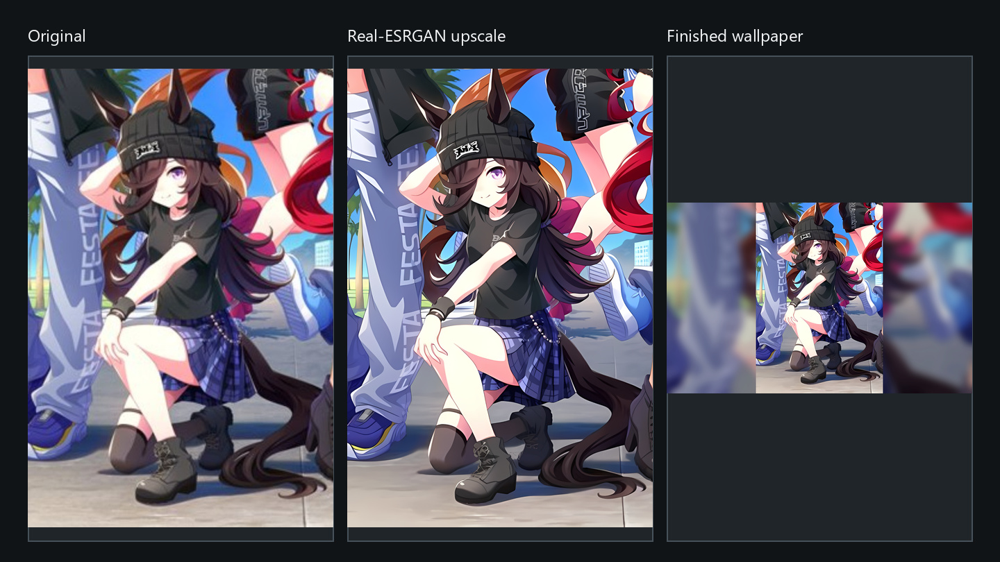

# Anime Wallpaper Upscaler

**基于官方 Real-ESRGAN 的 Windows 壁纸工作流（Windows wallpaper workflow built on official Real-ESRGAN）。**
本项目把上游 `realesrgan-ncnn-vulkan`/ncnn 推理程序封装成本地、默认保留完整构图的工作流；
不包含也不宣称原创超分算法或模型。

[English](README.md)



在仓库根目录运行一次安装命令：

```powershell
powershell.exe -NoProfile -ExecutionPolicy Bypass -File .\setup.ps1
```

然后把图片或文件夹拖到 `scripts\run-wallpaper.cmd` 或桌面快捷方式上，并选择 2、3、4 倍率。

上方概览把同一个保留竖向区域依次用于输入、官方上游推理和壁纸构图，仅作技术演示；其独立
权利状态和删除联系方式见[演示素材声明](docs/assets/NOTICE.md)。

## 本项目与官方 Real-ESRGAN 的区别

| 能力 | 官方 Real-ESRGAN / NCNN-Vulkan | 本项目 |
| --- | --- | --- |
| 超分推理与模型 | 提供算法、模型和 Vulkan 可执行程序 | 下载并调用官方发行版，不宣称原创算法或模型 |
| 完整构图壁纸 | 输出原始超分结果 | `preserve` 模式保留完整原图构图 |
| 适配物理屏幕 | 需要自行指定尺寸或后处理 | 自动检测主显示器物理分辨率，并保留手动覆盖 |
| 画面比例不一致 | 不负责壁纸构图 | 用同图的柔化模糊副本填充空余区域，前景不裁切 |
| 批量壁纸 | 上游程序有自己的文件/文件夹输入方式 | 增加多输入、递归、单图失败隔离和汇总日志 |
| 对比图 | 官方可执行程序不生成 | 默认自动生成可重复的细节前后对比图 |
| Windows 上手流程 | 提供程序与上游说明 | 增加校验安装、本地 Python 环境、拖放、快捷方式和修复指引 |

真正执行超分的是上游项目。本仓库的独立价值，是围绕上游推理整理出的 Windows 壁纸工作流。

## 环境要求

- 64 位 Windows 10/11，PowerShell 5.1 或更高版本。
- Python 3.10 或更高版本。
- 支持 Vulkan 的 GPU，以及较新的 NVIDIA、AMD 或 Intel 驱动。
- 足够存放官方程序、模型和输出图片的磁盘空间。

处理完全在本机进行，封装脚本不会上传输入图片，也不会生成式重绘原画。

## 安装

克隆仓库、进入目录，然后运行首屏中的安装命令。安装器会：

1. 展示上游来源和许可证提示；
2. 创建项目本地 `.venv` 并安装 `requirements.txt`；
3. 把固定版本的官方 Real-ESRGAN Windows 发行包下载到已忽略的 `tools/`；
4. 解压前校验文件大小和 SHA-256；
5. 安装 Codex skill junction，并创建拖放桌面快捷方式；
6. 运行命令行帮助冒烟测试。

官方可执行程序和模型只在安装时从上游下载，绝不会提交到本仓库。无人值守安装前，请先阅读
[第三方声明](THIRD_PARTY_NOTICES.md)，再使用 `-AcceptUpstreamLicense`。网络中断时，受控的临时
文件保留在 `tools\.downloads`，重新运行安装器可以续传。

### 手动使用官方运行时

高级用户可自行下载官方 Windows 压缩包，然后把解压目录传给封装脚本：

```powershell
.\.venv\Scripts\python.exe .\scripts\upscale_wallpaper.py `
  --input "C:\Pictures\wallpaper.png" `
  --tool-dir "C:\Tools\realesrgan-ncnn-vulkan-20220424-windows"
```

目录中必须有 `realesrgan-ncnn-vulkan.exe`，以及 `models\` 下与倍率兼容的 `.param` 和 `.bin`
文件。也可以在当前环境中用 `REALESRGAN_TOOL_DIR` 指向同一目录。

## 命令行

一次处理多个文件和一个文件夹：

```powershell
.\.venv\Scripts\python.exe .\scripts\upscale_wallpaper.py `
  --input "C:\Pictures\one.png" `
  --input "C:\Pictures\two.jpg" `
  --input "C:\Pictures\Wallpaper Folder" `
  --recursive `
  --scale 3 `
  --target auto `
  --gpu auto `
  --mode preserve
```

`--input` 接受 JPG、JPEG、PNG、WebP 或文件夹，可重复使用。文件夹默认只扫描顶层；加上
`--recursive` 后扫描子目录。重复路径只处理一次。

| 参数 | 含义与默认值 |
| --- | --- |
| `--input PATH` | 必填图片或文件夹；多输入时重复书写 |
| `--recursive` | 包含文件夹子目录中的支持格式图片 |
| `--scale {2,3,4}` | 上游超分倍率；默认 `4` |
| `--target auto\|WIDTHxHEIGHT` | 默认检测物理主屏；也可传入 `2560x1600` |
| `--gpu auto\|ID` | 探测 Vulkan 设备并默认由 ncnn 选择；可用输出中的数字 ID 覆盖 |
| `--model MODEL` | 覆盖按倍率自动选择的上游模型 |
| `--mode {preserve,cover}` | 默认 `preserve`；`cover` 会裁切以铺满屏幕 |
| `--out-dir PATH` | 把整批结果放到指定目录 |
| `--tool-dir PATH` | 使用手动安装的官方可执行程序和模型目录 |
| `--copy-desktop` | 额外复制每张成品壁纸到当前用户桌面 |
| `--compare-full-input` | 对比完整输入，而不是默认细节区域 |
| `--x-bias 0..1` / `--y-bias 0..1` | 调整 `cover` 裁切位置；默认 `0.5` |
| `--no-compare` | 不生成前后对比图 |
| `--no-upscaled-source` | 壁纸生成后删除原始超分 PNG |
| `--no-open-output` | 完成后不自动打开成功输出目录 |

`--target auto` 使用支持 DPI 感知的 Windows API。检测失败时会明确警告，临时使用
`2560x1600`，并提示如何手动覆盖。GPU 探测会列出官方程序报告的 Vulkan 设备；
`--gpu auto` 把最终设备选择交给 ncnn。

## 模式与输出

- `preserve`：完整图片居中，空余屏幕区域用同图的暗化模糊副本填充；这是默认模式。
- `cover`：通过裁切铺满屏幕；仅在可以舍弃边缘内容时使用。

没有 `--out-dir` 时，单个文件的结果放到同目录的 `Wallpaper Upscaler Output`，文件夹批量
结果放到该文件夹内部的同名输出目录。递归任务会保留相对子目录结构。每个成功项目通常生成：

- `<名称>_realesrgan_<倍率>x.png`：官方运行时的原始输出；
- `<名称>_wallpaper_AI_<宽>x<高>_<模式>_<倍率>x.jpg`：最终壁纸；
- `<名称>_AI_compare_<倍率>x.jpg`：细节对比图。

每个输出根目录都有 `anime-wallpaper-upscaler.log`，记录成功/失败数量和逐项结果。单张坏图
不会中止其余批次；部分失败返回退出码 `1`，安装或输入错误返回 `2`。

## 故障修复

| 现象 | 处理方法 |
| --- | --- |
| 找不到 Python，或版本低于 3.10 | 从 [python.org](https://www.python.org/downloads/windows/) 安装 64 位 Python，勾选 **Add python.exe to PATH**，新开 PowerShell 后重跑 `setup.ps1` |
| 下载中断或网络失败 | 检查是否能访问 GitHub Releases，再重跑 `setup.ps1`；受校验约束的部分下载会保留以便续传 |
| 缺少可执行程序或模型 | 重跑 `setup.ps1`，或用 `--tool-dir` 指向已解压的官方目录 |
| 未发现 Vulkan GPU / Vulkan 初始化失败 | 更新 [NVIDIA](https://www.nvidia.com/Download/index.aspx)、[AMD](https://www.amd.com/en/support/download/drivers.html) 或 [Intel](https://www.intel.com/content/www/us/en/download-center/home.html) 驱动后重试 |
| 手动 GPU ID 被拒绝 | 查看命令输出的设备列表，传入其中的数字 ID，或改用 `--gpu auto` |
| 图片损坏或格式不受支持 | 重新导出为有效的 JPG、JPEG、PNG 或 WebP，再运行批次 |

## 重建演示排版

仓库用脚本保证概览图可重复生成，不依赖手工拼图：

```powershell
python .\scripts\build_demo_assets.py `
  --source "C:\Demo\original.png" `
  --upscaled "C:\Demo\original_realesrgan_4x.png" `
  --wallpaper "C:\Demo\original_wallpaper.jpg" `
  --overview ".\docs\assets\workflow-overview.jpg" `
  --social-preview ".\docs\assets\social-preview.jpg"
```

三联图中的每个面板都会完整 contain-fit，不裁切内容。请只使用自己创作或明确获准再分发的原图。

## 上游署名与许可证

本项目是基于 [Real-ESRGAN](https://github.com/xinntao/Real-ESRGAN)、
[Real-ESRGAN-ncnn-vulkan](https://github.com/xinntao/Real-ESRGAN-ncnn-vulkan) 和
[ncnn](https://github.com/Tencent/ncnn) 的集成封装。推理代码、模型、可执行程序及相关组件继续
适用各自的上游许可证，详见[第三方声明](THIRD_PARTY_NOTICES.md)。

MIT 许可证仅适用于本仓库自己的封装代码和文档，并受[演示素材声明](docs/assets/NOTICE.md)中的
排除项约束。保留的对比图及未来由它衍生的概览图/社交预览图归各自权利人所有；“可联系删除”
这句话本身不授予任何再分发权。权利人可在
[项目 Issues](https://github.com/zc4578980-tech/anime-wallpaper-upscaler/issues) 提出删除请求。
